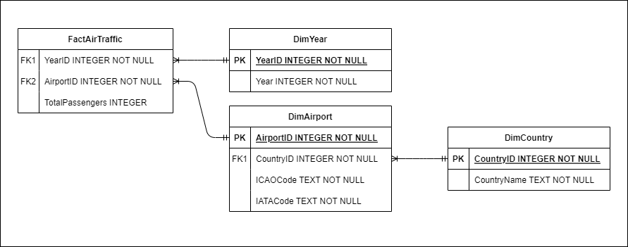

# Python and SQL test

### Overview

This README provides an overview of the solution developed using Python to retrieve data from a json, store it in a SQLITE3 database, query and print the total passengers per country.

To run the solution, execute the Python file `challenge_solution.py`. This script will read the `data.json` file in the repository and display the total number of passengers per country. You can modify the argument passed to the main function and include multiple JSON files. For testing this functionality, I have provided `data_part_1.json` and `data_part_2.json`, each containing half of the data from `data.json`.

### Table of Contents
1. [Task Description](#task-description)
2. [Table Modeling](#table-modeling)
3. [Implementation Details](#implementation-details)
4. [Functions](#functions)
5. [Possible Future Enhancements](#possible-future-enhancements)

### Task Description
Using raw Python (you cannot use any secondary analytic library such as SciPy, Pandas, Pyspark, etc. but you can use default Python libraries such as csv and json), develop a script that:
- Uploads the attached JSON file to memory
- Saves it in a SQLITE3 database table (this is a common tiny relational database)
- By using SQL, it reads the loaded database to sum and show in the console the total passengers per country

Meaning of the fields in the attached file (data.json):
- year: calendar year when the flight took off
- country: name of the country from were the flight took off
- iata_code: IATA code of the airport
- icao_code: ICAO code of the airport
- total passengers: number of passengers that took a flight on the specified dimensions

### Table Modeling

The JSON data is structured with the following hierarchy:

- Each record contains a year, a country, and a list of airports.
- Each airport has an IATA code, an ICAO code, and a total number of passengers.

I used the star schema to model the data into the four tables above: three dimensions and one fact table.
With this structure, the tables are in the 3rd normal form (no repeating values or groups, no partial dependencies on tables with composite keys, and no transitive dependencies).

### Implementation Details

The code is very straightforward, given the required tasks (loading a JSON, creating a database, storing the data, and printing a result). However, I would like to highlight some decisions I made while creating the code:

- The code can handle multiple JSON files ensuring that duplicate entries are not inserted. This scenario is useful when the tables already exist and contain data, and there is a need to query the dimensions to retrieve their primary keys for inserting data into the fact table.

- I chose to create a function to check the JSON structure, to assert that it has all the necessary fields, otherwise, an unstructured JSON could create inconsistencies in the tables or errors during the execution.

- The code is organized to minimize the operations involving the database. For each JSON file, there will be four batch inserts (one for each table) and three selects (to retrieve the PK of the inserted values on the dimensions and use them in the insert of the fact table).

### Functions

1. **load_json_data**

    Load and return the JSON file.
   
2. **validate_json_structure**

    Check the loaded JSON structure to assert that it has the expected structure for database insertion.

3. **create_tables**
    
    Create the fact and dimensions tables.

4. **batch_insert**

    Insert multiple rows in a table.

5. **get_id_mapping**

    For given values of a dimension table, return the PK of these values.

6. **extract_data_from_json**

    Given the loaded JSON, return a dictionary with the organized values to be inserted in the fact and dimensions tables.

7. **populate_tables**

    Insert data in the fact and dimensions tables.

8. **query_total_passengers_per_country**

    Query the tables and print the number of passengers grouped by country.

9. **main**

    Create the tables and insert one or more JSON files into them.

### Possible Future Enhancements

To improve the robustness of the code, the following improvements can be made:

- Create unit tests to test the functions.
- Verify that there are no missing values in the JSON fields.
- Test data inconsistencies, such as:
    - Unrealistic values for years.
    - Nonexistent country names.
    - Nonexistent ICAO or IATA values.
    - ICAO associated with more than one IATA.
